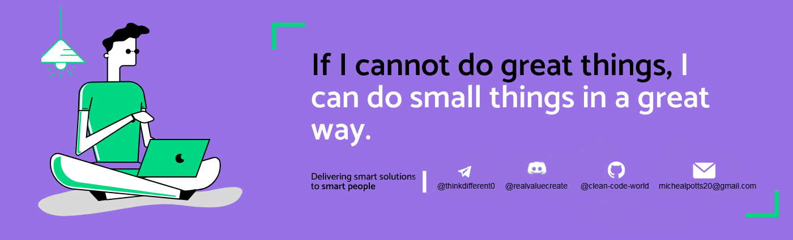

<h1 align="center">Hello I'm Micheal</h1>

<!--
**soumyajit4419/soumyajit4419** is a ✨ _special_ ✨ repository because its `README.md` (this file) appears on your GitHub profile.
Here are some ideas to get you started: -->

  
  

  

## 👨🏻‍💻 About Me:

I’m a full-stack engineer with a strong focus on blockchain and Web3.  
I enjoy solving complex problems with clean, scalable solutions and building products that push tech boundaries.  
My current work revolves around decentralized applications and smart contracts, and I’m always exploring new blockchain protocols and Web3 tools.  
I love collaborating on open-source projects, mentoring developers, and sharing knowledge across the community.  
When I’m not coding, I’m probably experimenting with new ideas—or debating how decentralized the future should really be.

## 🛠️ Technologies and Tools I use:

### Frontend Development

### Backend Development

### Blockchain & Web3

### DevOps & Tools

## 🤝 Connect With Me

  
  
  
  
  
  

---

## My GitHub Data:

  
  

---

## Dev Quote

  

---

  

---
